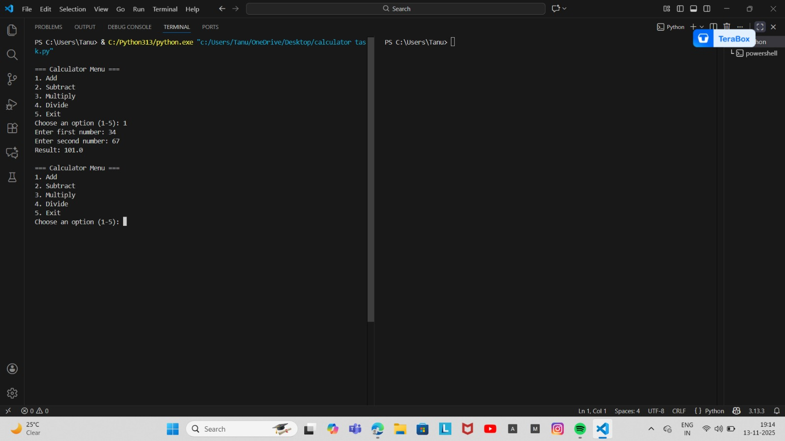

# CLI Calculator (Python)

A simple command-line calculator built using Python.
Supports basic arithmetic operations: Addition, Subtraction, Multiplication, and Division in a clean menu-driven format.

# ⭐Features

Modular function-based structure
Numeric input validation
Division-by-zero handling
Loop-based menu system
Creative terminal UI
Runs directly in any CLI (PowerShell, CMD, Linux Terminal)

# How to Run:

1. Clone the repo
git clone https://github.com/bhagwanitanu/calculator task.py.git

2. Navigate to the folder
cd  calculator task.py

3. Run the calculator
python calculator task.py

# Calculator Output:

Here is an example of how the app looks:

# Project Structure:
calculator task.py
README.md

# 🔮Future Enhancements

Expression parsing (e.g., 2+3*4)
Operation history
GUI version (Tkinter/PyQt)
Error logging and debugging mode

📜 License
This project is licensed under the MIT License.
